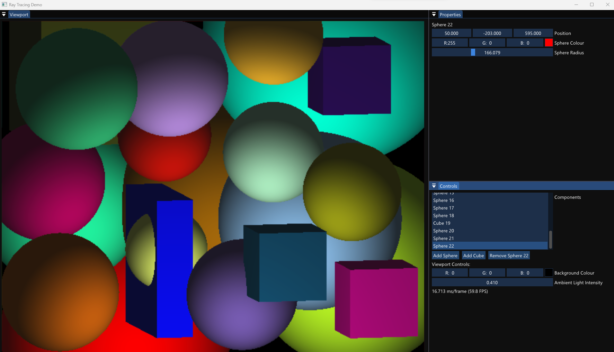

# RayTracing

[Demo Video](https://youtu.be/Sa3a5IrefFk)

As part of my course work for a computer graphics module, I was tasked with writing a basic ray tracer that could render an image with many spheres that had ambient and diffuse shading. I decided to complete this in C++ and also add a few extra features for fun such as rendering of cubes, rotating the camera around a point, and controls for changing all the shapes and parameters that affect the final image.

I had to present my solution in a viva where I demoed the working project and explained how some parts worked, this achieved a final mark of 100%.
